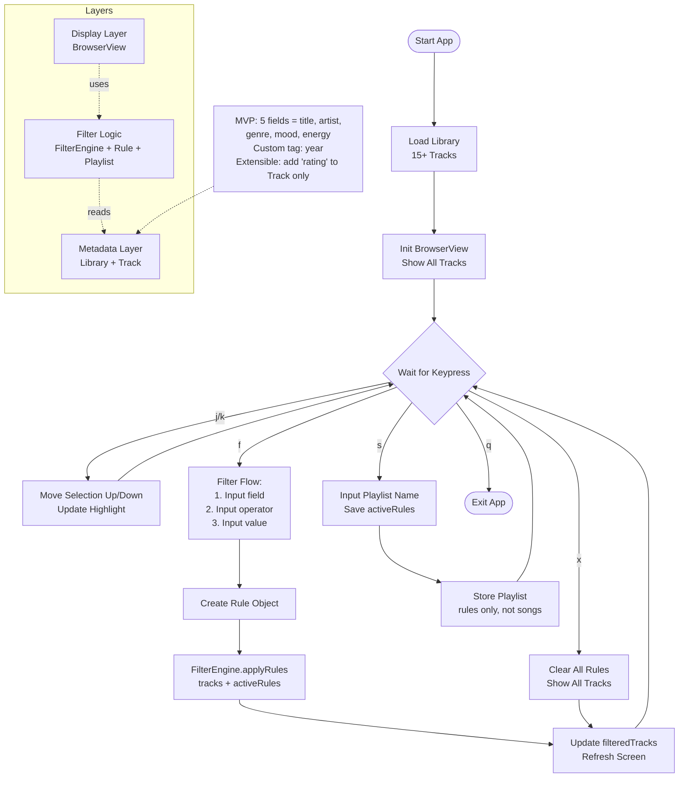
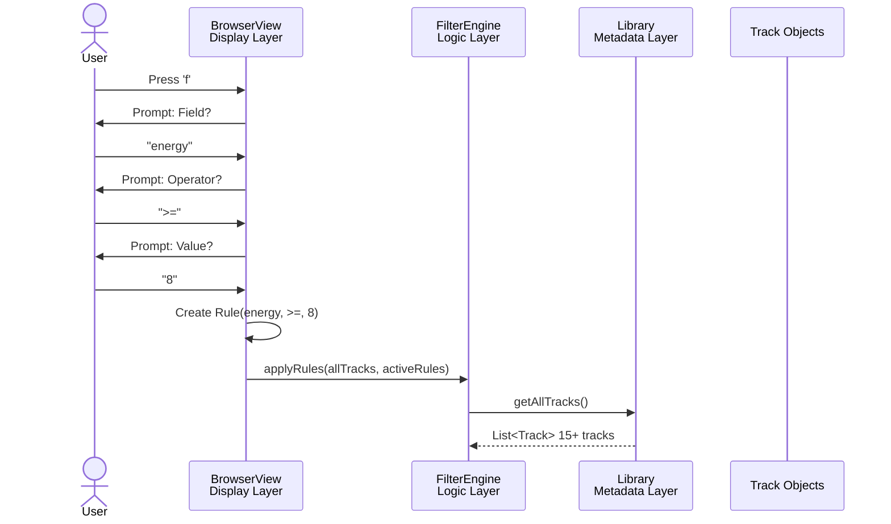

# Libretto
A terminal-based music library organizer with metadata tagging and dynamic, rule-based playlists.
A console TUI for organizing music libraries through structured metadata tags and interactive keyboard-driven browsing.

Flowchart - System Architecture + User Flow

Sequence Diagram - "User Presses f" Flow

